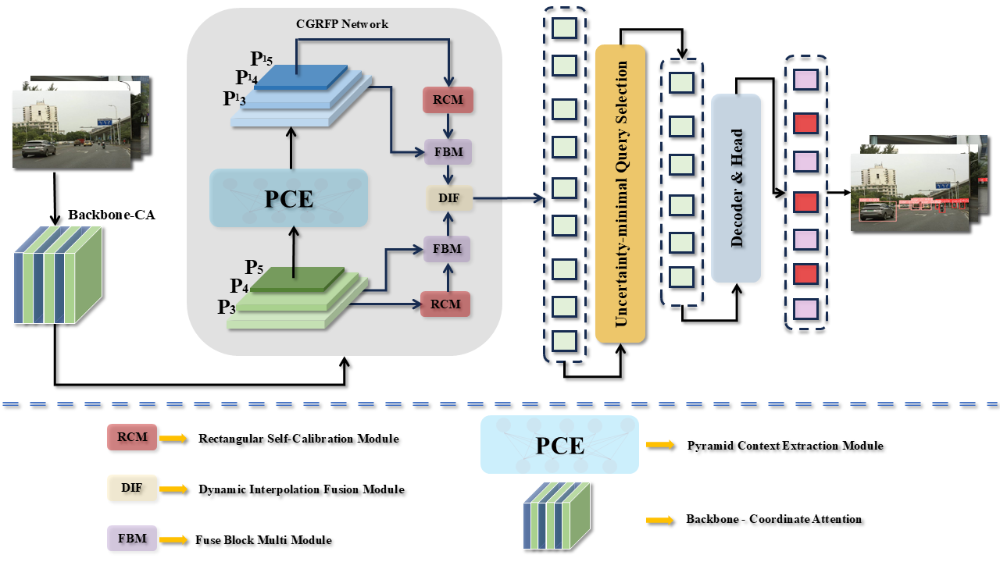

# TAR-DETR: Urban Traffic Objects Detection
## Method:
To address the reduced accuracy of people and car detection models in urban traffic with multiple object sources, we designed and integrated a series of optimization methods to develop an object detection network for urban traffic: the Context-Guided Reconstruc-tion Feature Network (CGRFN). As depicted in Figure 6, this section describes the overall framework of TAR-DETR and the optimization methods (CGRFN, Pyramid Context Ex-traction Module, Fuse Block Multi-Module and Dynamic Interpolation Fusion Module).

## Requirements
| Package        | Version Requirement | Description                             |
|----------------|---------------------|-----------------------------------------|
| matplotlib     | >=3.3.0             | Plotting library                        |
| numpy          | >=1.22.2            | Numerical operations                    |
| opencv-python  | >=4.6.0             | Image processing                        |
| pillow         | >=7.1.2             | Image processing library                |
| pyyaml         | >=5.3.1             | YAML parser and emitter                 |
| requests       | >=2.23.0            | HTTP library                            |
| scipy          | >=1.4.1             | Scientific computing                    |
| torch          | >=1.8.0             | Deep learning                           |
| torchvision    | >=0.9.0             | Deep learning (models and utilities)    |
| tqdm           | >=4.64.0            | Progress bars                           |
| pandas         | >=1.1.4             | Data manipulation                       |
| seaborn        | >=0.11.0            | Data visualization                      |
| thop           | >=0.1.1             | FLOPs computation                       |
## Required Data
To evaluate or train TAR-DETR you will need to download the datasets:
| Dataset Name  | Link |
|---------------|------|
| TAR-1 Dataset | [Download Urban Traffic Objects Dataset](https://doi.org/10.6084/m9.figshare.27720405.v1) |
## Training
When you perform training, the corresponding TAR-1 dataset needs to be replaced in the appropriate root folder.
